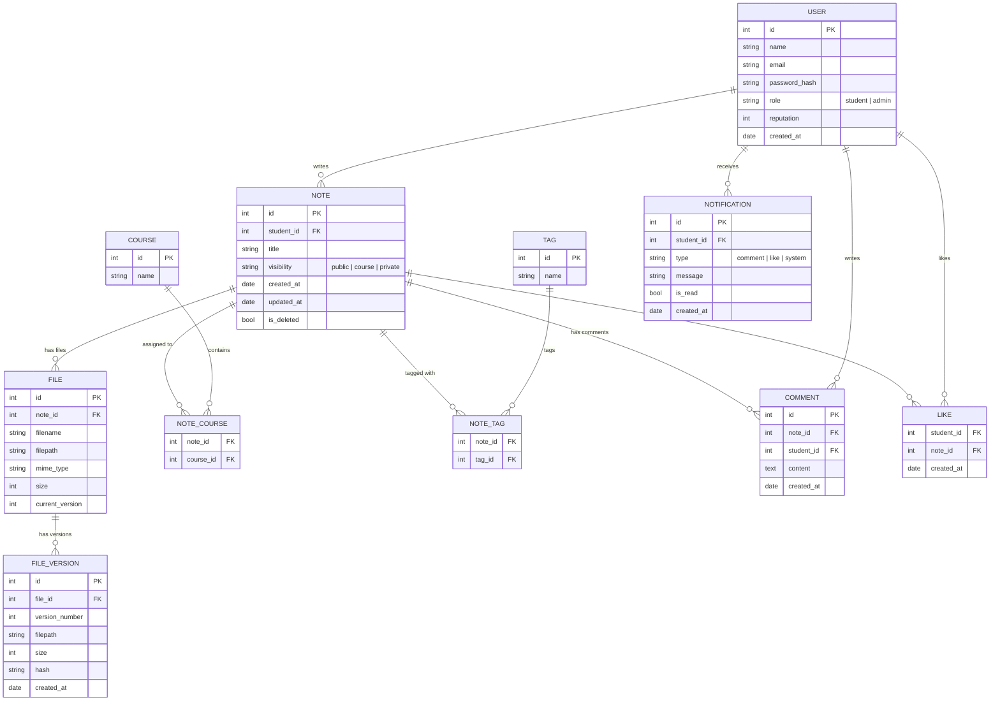
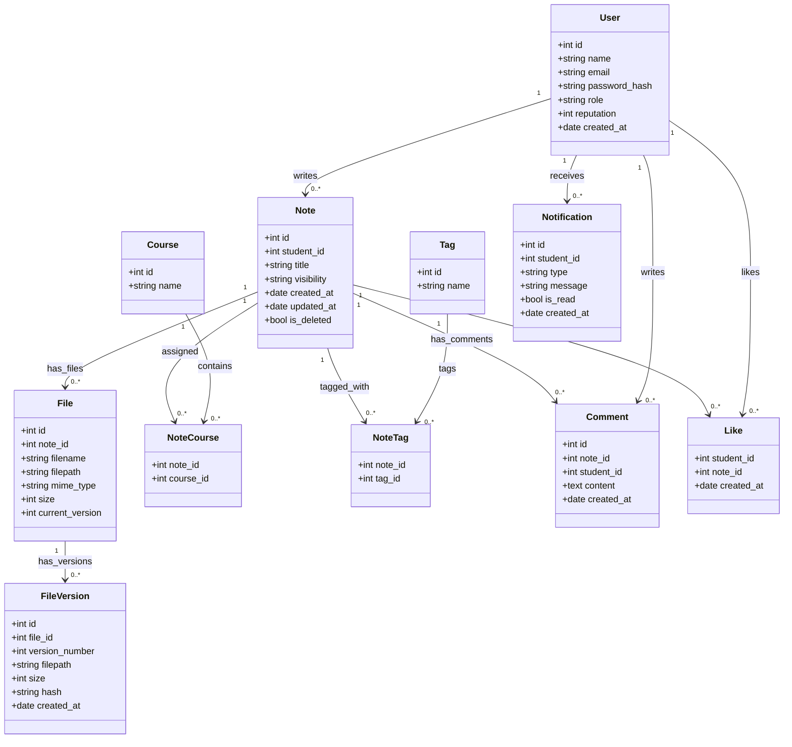

# 📘 Specifiche Descrittive del Database

## 🎯 Obiettivo generale del sistema
Il sistema permette agli studenti di condividere appunti accademici sotto forma di note e file allegati.  
Gli utenti possono caricare documenti, aggiornarli, commentarli e valutarli.  
Le note possono essere catalogate tramite corsi e tag, e gli studenti ricevono notifiche ogni volta che gli altri interagiscono con i loro contenuti.

Il versionamento è applicato **sui file** allegati alle note, non sulle note stesse.


## 👥 Gestione degli Utenti (`USER`)
Il sistema prevede due tipologie di utenti: **studenti** e **amministratori**.  
Ogni utente registrato possiede:

- un nome  
- un indirizzo email univoco  
- una password salvata come hash  
- un ruolo (student/admin)  
- un valore di reputazione che aumenta in base ai like ricevuti  

Gli utenti possono:

- creare note  
- caricare file  
- aggiornare file (creando nuove versioni)  
- commentare note  
- mettere like  
- ricevere notifiche  

Il ruolo di amministratore permette di gestire eventuali moderazioni o comunicazioni di sistema.

---

## 📝 Gestione delle Note (`NOTE`)
Una nota rappresenta un **contenitore informativo** composto da:

- titolo  
- autore  
- date di creazione e aggiornamento  
- visibilità (public, course, private)  
- stato (soft delete possibile)  

Le note **non vengono versionate**.  
Sono piuttosto la “cornice” entro cui si collocano i file allegati, che invece hanno versionamento.

Le note possono essere collegate a:

- uno o più corsi  
- uno o più tag  

---

## 📎 Gestione dei File e Versionamento (`FILE`, `FILE_VERSION`)
Gli appunti reali sono rappresentati dai **file allegati** alle note.

Ogni file ha:

- metadati generali (nome, tipo, dimensione, percorso)  
- un riferimento alla **versione corrente**  
- una serie di versioni salvate in uno storico separato  

### Processo di aggiornamento di un file
Quando un file viene modificato, non viene sovrascritto:

1. viene generata una nuova voce in `FILE_VERSION`  
2. il record principale in `FILE` viene aggiornato alla nuova versione corrente  

Ogni versione conserva:

- percorso file specifico  
- dimensione  
- data creazione  
- hash di integrità  

Questo consente rollback, audit e gestione precisa del materiale condiviso.

---

## 📚 Corsi e Classificazione delle Note (`COURSE`, `NOTE_COURSE`)
Le note possono essere collegate a corsi universitari.

La relazione molti-a-molti consente:

- organizzazione strutturata del materiale  
- ricerca delle note associate a una materia specifica  

Una nota può appartenere a più corsi contemporaneamente.

---

## 🏷 Tag e Etichettatura Flessibile (`TAG`, `NOTE_TAG`)
Oltre ai corsi, il sistema supporta tag liberi.

I tag permettono una classificazione personalizzabile, ad esempio:

- “riassunto”  
- “formulario”  
- “teoria”  
- “esercizi”  

Il collegamento many-to-many consente a ogni nota di avere più tag.

---

## 💬 Commenti alle Note (`COMMENT`)
Gli studenti possono commentare una nota per:

- fare domande  
- correggere o suggerire modifiche  
- discutere il contenuto  

Ogni commento contiene:

- l’autore  
- la nota di riferimento  
- testo  
- data di creazione  

---

## 👍 Like e Reputazione (`LIKE`)
Il sistema consente di esprimere apprezzamento tramite like.  
È consentito un solo like per utente per ogni nota (PK composta).

Ogni like:

- aumenta la reputazione dell’autore della nota  
- può generare una notifica  

La reputazione fornisce una semplice forma di riconoscimento e gamification.

---

## 🔔 Sistema di Notifiche (`NOTIFICATION`)
Le notifiche servono a migliorare l’esperienza utente.  
Il sistema genera una notifica quando:

- una nota riceve un commento  
- una nota riceve un like  
- vengono pubblicati annunci da admin  

Ogni notifica contiene:

- destinatario  
- tipo (comment, like, system)  
- messaggio descrittivo  
- data  
- stato di lettura  

---

## 📁 Struttura consigliata per i file
Per facilitare gestione e versionamento, si suggerisce una struttura come:
```yaml
/files/
    note_{id}/
        file_{id}/
            v1.pdf
            v2.pdf
            v3.pdf
```

Questo schema permette di recuperare facilmente ogni versione e mantenere ordine nei contenuti.


## Diagramma ER

Schema ER del database.


## UML
Schema UML delle classi attive nel progetto.
