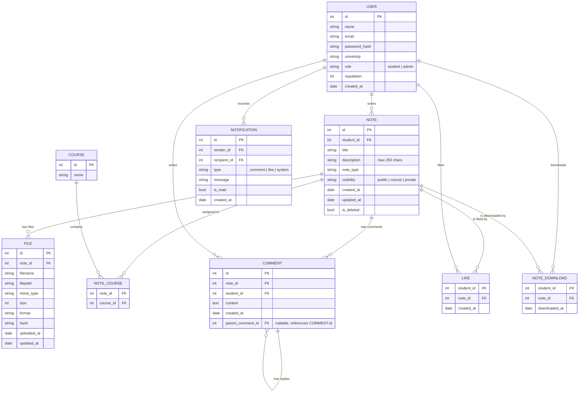
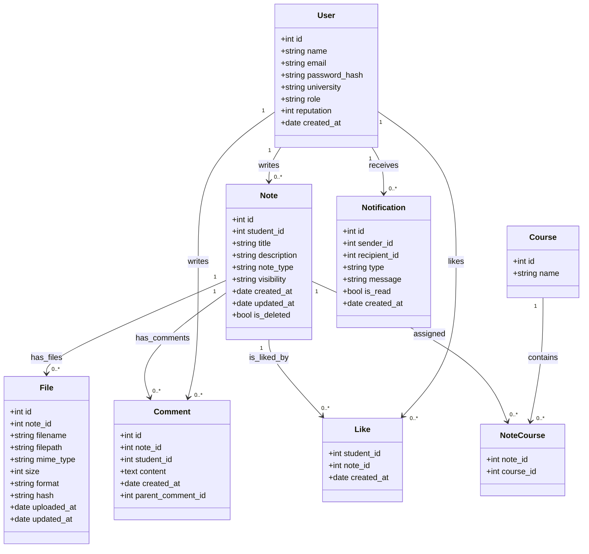

# 📘 Specifiche Descrittive del Database

## 🎯 Obiettivo generale del sistema
Il sistema permette agli studenti di condividere appunti accademici sotto forma di note e file allegati.  
Gli utenti possono caricare documenti, aggiornarli, commentarli e valutarli.  
Le note possono essere catalogate tramite corsi e attributi strutturati; gli studenti ricevono notifiche ogni volta che altri interagiscono con i loro contenuti.

I file allegati non sono versionati: gli aggiornamenti sovrascrivono il file esistente. Se è necessario mantenere uno storico, usare storage esterno o un audit log.

## 👥 Gestione degli Utenti (`USER`)
Il sistema prevede due tipologie di utenti: **studenti** e **amministratori**.  
Ogni utente registrato possiede:

- un nome  
- un indirizzo email univoco  
- una password salvata come hash  
- università (User.university)  
- un ruolo (student/admin)  
- un valore di reputazione che aumenta in base ai like ricevuti  
- date di creazione

Gli utenti possono:

- creare note  
- caricare file  
- aggiornare file (sovrascrivendo il file esistente)  
- commentare note  
- mettere like  
- ricevere notifiche  

Il ruolo di amministratore permette di gestire moderazioni o comunicazioni di sistema.

---

## 📝 Gestione delle Note (`NOTE`)
Una nota rappresenta un **contenitore informativo** composto da:

- titolo  
- autore  
- descrizione (max 250 caratteri)  
- tipo di nota (Note.note_type — es. riassunto, formulario, esercizi)  
- date di creazione e aggiornamento  
- visibilità (public, course, private)  
- stato (soft delete possibile)  

Le note non vengono versionate. Sono la “cornice” entro cui si collocano i file allegati.

Le note possono essere collegate a:

- uno o più corsi

---

## 📎 Gestione dei File (`FILE`)
Gli appunti reali sono rappresentati dai **file allegati** alle note.

Ogni file ha:

- metadati generali (nome, mime_type, dimensione, filepath)  
- formato (File.format — es. pdf, docx, pptx)  
- hash di integrità  
- uploaded_at, updated_at

Aggiornamento file: il nuovo upload sovrascrive il file esistente (stesso record FILE aggiornato). Per audit/restore si consiglia un audit log esterno o backup.

---

## 📚 Corsi e Classificazione delle Note (`COURSE`, `NOTE_COURSE`)
Le note possono essere collegate a corsi universitari.  
La relazione molti-a-molti consente organizzazione strutturata del materiale. Una nota può appartenere a più corsi contemporaneamente.

---

## 🏷 Attributi strutturati (sostituiscono i tag liberi)
I tag liberi sono stati rimossi in favore di attributi strutturati:

- File.format: formato del file (es. pdf, docx, pptx) — attributo del record FILE  
- User.university: università di appartenenza — attributo del record USER  
- Note.note_type: tipo di nota (es. riassunto, formulario, esercizi) — attributo del record NOTE

Questa scelta semplifica ricerca e filtro per proprietà strutturate, a costo di perdere l'estensibilità dei tag liberi.

---

## 💬 Commenti alle Note (`COMMENT`)
Gli studenti possono commentare una nota per:

- fare domande  
- correggere o suggerire modifiche  
- discutere il contenuto  

Ogni commento contiene:

- l’autore  
- la nota di riferimento  
- testo  
- data di creazione  
- parent_comment_id per thread annidati (nullable)

Per performance su thread profondi valutare approcci alternativi (path, closure table).

---

## 👍 Like e Reputazione (`LIKE`)
Il sistema consente di esprimere apprezzamento tramite like.  
È consentito un solo like per utente per ogni nota (PK composta).

Ogni like:

- aumenta la reputazione dell’autore della nota  
- può generare una notifica

---

## 🔔 Sistema di Notifiche (`NOTIFICATION`)
Le notifiche servono a migliorare l’esperienza utente.  
Il sistema genera una notifica quando:

- una nota riceve un commento  
- una nota riceve un like  
- vengono pubblicati annunci da admin  

Ogni notifica contiene:

- mittente (sender_id)  
- destinatario (recipient_id)  
- tipo (comment, like, system)  
- messaggio descrittivo  
- data  
- stato di lettura  
- (opzionale) payload JSON per dati dinamici (es. comment_id, note_id)

---

## 📁 Struttura consigliata per i file (senza versioning)
Esempio semplice per storage:

/files/
    note_{note_id}/
        file_{file_id}.{ext}    # file corrente sovrascritto all'update

Se si desidera storicizzare, usare folder con timestamp o gestire backup separati.

---

## Diagramma ER

Schema ER del database.

## UML
Schema UML delle classi attive nel progetto.

TODO:
- Mettere paginazione