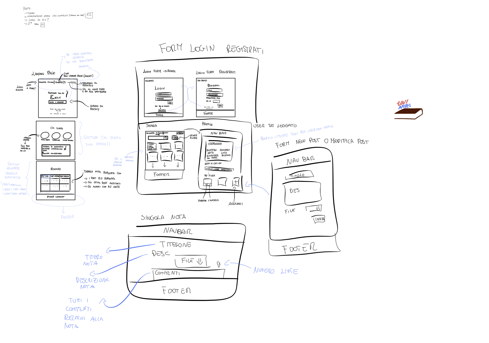
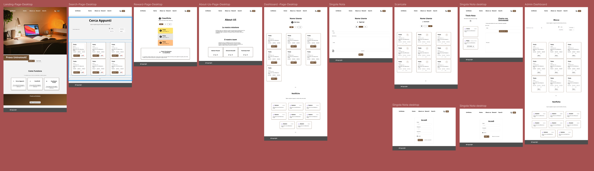
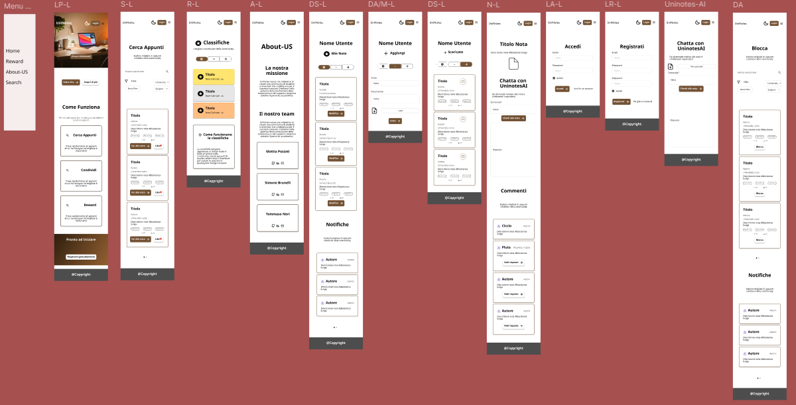
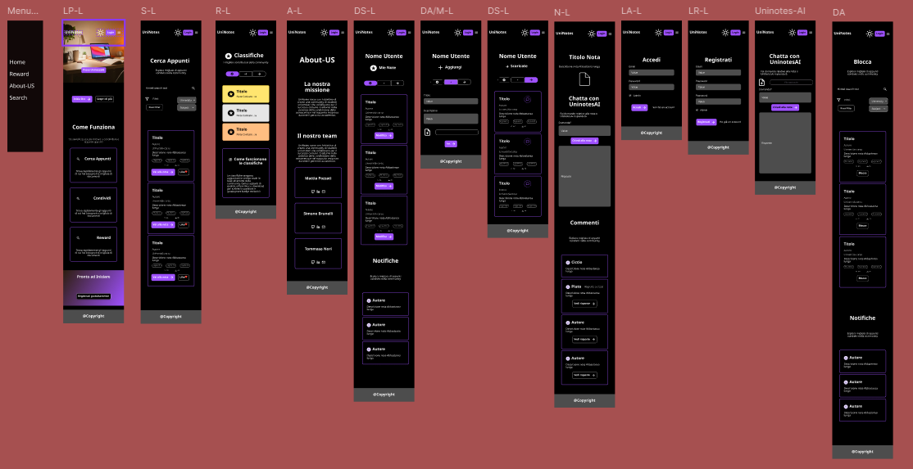

# UniNotes
## Relazione sulla Fase di Progettazione
*Simone Brunelli, Mattia Pozzati, Tommaso Nori*

---

## 1. Introduzione
UniNotes è una piattaforma web progettata per la condivisione di materiale didattico universitario, che permette agli studenti di caricare, ricercare, commentare e valutare appunti in modo rapido e intuitivo. Il sistema integra funzionalità avanzate come un sistema di reputazione, notifiche real-time e chat AI per l'analisi del contenuto delle note.

---

## 2. Progettazione ed prototipazione
La definizione dell'interfaccia definitiva di UniNotes è stata strutturata in tre fasi distinte. Questo approccio ci ha permesso di validare le scelte iniziali e di modificarle in base alle reali necessità degli studenti. I mockup sono stati realizzati con l'utilizzo del software Figma.

### Fase 1: Mockup Iniziali e Ipotesi di Progetto
Inizialmente, i mockup sono stati realizzati seguendo le linee guida di progettazione standard, ipotizzando le funzionalità classiche di un sito di condivisione appunti.

### Fase 2: Sessione di prototipazione
Per verificare l'efficacia di queste ipotesi, abbiamo condotto una sessione di sviluppo coinvolgendo un gruppo di utenti target (studenti universitari di diverse facoltà).

Sono emerse delle necessità e criticità:

- **Sistema di Interazione Sociale**: Gli utenti hanno espresso la necessità di poter interagire con le note attraverso like e commenti, non solo valutazioni.
- **Notifiche e Feedback**: Gli utilizzatori hanno fatto emergere la necessità di ricevere notifiche quando qualcuno interagisce con i loro contenuti.
- **Dashboard Personalizzata**: Gli studenti volevano una vista centralizzata per gestire le proprie note, quelle scaricate e le notifiche ricevute.
- **Ricerca Avanzata**: È emersa la necessità di filtri più granulari per trovare appunti specifici (università, corso, formato, tipo).
- **Dark Mode**: Richiesta esplicita di supporto per tema scuro, essenziale per sessioni di studio notturne.

## Mockup

### Desktop - Light Mode

### Desktop - Dark Mode

### Mobile - Light Mode

### Mobile - Dark Mode

### Fase 3: Evoluzione e miglioramento mockup
Sulla base dei risultati della Fase 2, abbiamo modificato i mockup producendo la versione finale del progetto:

#### 1. Sistema di Like e Commenti
Abbiamo implementato un sistema di interazione che permette agli utenti di:
- Mettere like alle note
- Commentare e rispondere ai commenti
- Visualizzare statistiche di engagement (like e download)

#### 2. Dashboard Unificata
È stata creata una dashboard personalizzata con sezioni tabbed per:
- Visualizzare e gestire le proprie note
- Accedere alle note scaricate
- Ricevere notifiche in tempo reale
- Caricare nuove note

#### 3. Sistema di Notifiche
Implementato un sistema completo di notifiche per:
- Nuovi like ricevuti
- Nuovi commenti
- Aggiornamenti delle note scaricate
- Comunicazioni amministrative

#### 4. Ricerca Avanzata con Filtri
La pagina di ricerca è stata arricchita con:
- Filtri per università, corso, formato file e tipo di nota
- Barra di ricerca full-text
- Visualizzazione a griglia responsive

#### 5. Dark Mode e Temi
Implementazione completa di un sistema di temi con:
- Toggle dark/light mode
- Persistenza della preferenza
- Variabili CSS custom per manutenibilità

#### 6. Implementazione AI
Integrazione di un sistema di chat AI per l'analisi intelligente del contenuto delle note:
- Estrazione automatica del testo da file PDF tramite pdftotext
- Integrazione con OpenRouter API per elaborazione linguaggio naturale
- Interfaccia Q&A che permette agli studenti di porre domande sul contenuto
- Contestualizzazione delle risposte basata esclusivamente sul materiale caricato
---
